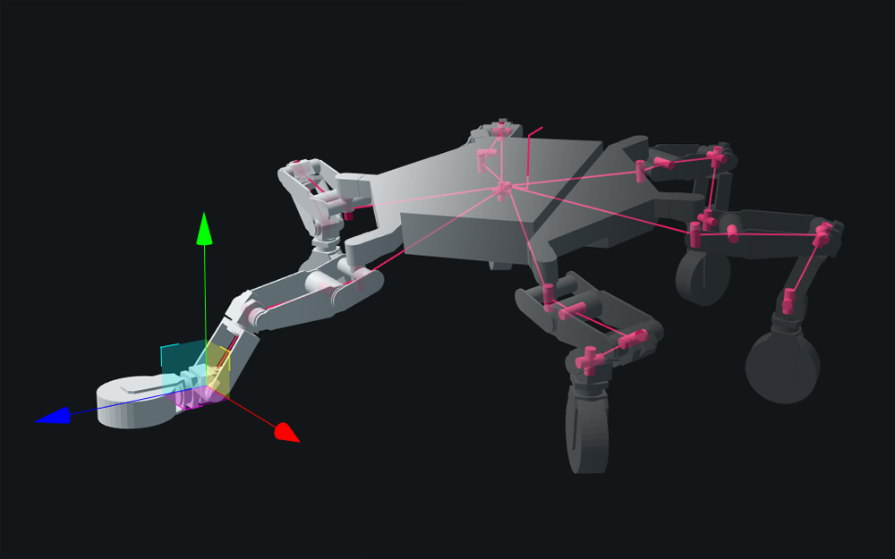

# Closed Chain Inverse Kinematics

[](https://travis-ci.com/gkjohnson/closed-chain-ik-js)
<!-- [](https://lgtm.com/projects/g/gkjohnson/closed-chain-ik-js/) -->

A generalized inverse kinematics solver that supports closed chains for parallel kinematics systems, dynamic reconfiguration, and arbitrary joint configuration based on damped least squares error minimization techniques. Supports all variety of joints including combinations of rotation and translation degrees of freedom and is agnostic to visualization framework. Inspired by [Marty Vona's MSim research work](https://www2.ccs.neu.edu/research/gpc/MSim/MSim-info.html) and using techniques outlined in this [2009 paper by Samuel Buss](https://math.ucsd.edu/~sbuss/ResearchWeb/ikmethods/iksurvey.pdf). Developed with some aid and advice from [Marty Vona](https://www2.ccs.neu.edu/research/gpc/vona.html).



_<p align="center">Solver being used on JPL's ATHLETE robot for full body IK</p>_

[ATHLETE and Robonaut demo here](https://gkjohnson.github.io/closed-chain-ik-js/dist/index.html)!

[Partial degrees of freedom Goal demo here](https://gkjohnson.github.io/closed-chain-ik-js/dist/goals.html)!

## Model License Information

Robitics models used in the project are for demonstration purposes only and subject to the lincenses of their respective projects.

[ATHLETE](https://github.com/gkjohnson/urdf-loaders/)

[Robonaut](https://github.com/gkjohnson/nasa-urdf-robots)

# Use

## Simple 2 DoF System

```js
import { Solver, Joint, Link, Goal, DOF } from 'closed-chain-ik';

// Create links and joints
const link1 = new Link();

const joint1 = new Joint();
joint.setDoF( DOF.EZ );
joint.setPosition( 0, 1, 0 );
joint.setDoFValues( Math.PI / 4 );

const link2 = new Link();

const joint2 = new Joint();
joint.setDoF( DOF.EX );
joint.setPosition( 0, 1, 0 );
joint.setDoFValues( Math.PI / 4 );

const link3 = new Link();
link3.setPosition( 0, 1, 0 );

// Create the goal
const goal = new Goal();
link.getWorldPosition( goal.position );
link.getWorldQuaternion( goal.quaternion );

// Create structure
link1.addChild( joint1 );
joint1.addChild( link2 );
link2.addChild( joint2 );
joint2.addChild( link3 );

goal.makeClosure( link3 );

// create solver
const solver = new Solver( [ link1, goal ] );

// ...

// move the goal around and solve
solver.solve();
```

## Using a WebWorker Solver

```js
import { WorkerSolve, Joint, Link, Goal, DOF } from 'closed-chain-ik';

// ... instantiate kinematic system...

const solver = new WorkerSolver( [ link1, goal ] );

// ...

// move the goal around and solve asynchronously
solver.solve();
```

# API

## Constants

### DOF

Enumerated fields representing different degrees of freedom for Joints.

```js
// Translation DoF
DOF.X, DOF.Y, DOF.Z,

// Euler Rotation DoF
DOF.EX, DOF.EY, DOF.EZ,
```

### DOF_NAMES

An array of strings representing the names of the above degrees of freedom.

### SOLVE_STATUS

Enumerated fields representing the state of a solve result.

```js
// Error for all goals are within
// the threshold.
SOLVE_STATUS.CONVERGED,

// Error for the goals has begun
// to diverge.
SOLVE_STATUS.DIVERGED,

// Resulting angles has not changed
// significantly enough to reach the
// stall threshold.
SOLVE_STATUS.STALLED,

// The solve has reached the maximum
// number of allowed iterations.
SOLVE_STATUS.TIMEOUT,
```

### SOLVE_STATUS_NAMES

An array of strings representing the names of the above solve statuses.

## Functions

Set of functions for creating an ik system from and working with results from [URDFLoader](https://github.com/gkjohnson/urdf-loaders/tree/master/javascript).

### urdfRobotToIKRoot

```js
urdfRobotToIKRoot( robot : URDFRobot ) : Joint
```

### setUrdfFromIK

```js
setUrdfFromIK( robot : URDFRobot, ikRoot : Joint ) : void
```

### setIKFromUrdf

```js
setIKFromUrdf( ikRoot : Joint, robot : URDFRobot ) : void
```

## Frame

A base class for `Link`, `Joint`, and `Goal` representing a frame defined by a position and rotation in space.

### .position

```js
position : Float32Array[ 3 ]
```

### .quaternion

```js
quaternion : Float32Array[ 4 ]
```

### .matrix

```js
readonly matrix : Float64Array[ 16 ]
```

### .matrixWorld

```js
readonly matrixWorld : Float64Array[ 16 ]
```

### .parent

```js
readonly parent : Frame
```

### .children

```js
readonly children : Array<Frame>
```

### .setPosition

```js
setPosition( x : Number, y : Number, z : Number ) : void
```

### .setWorldPosition

```js
setWorldPosition( x : Number, y : Number, z : Number ) : void
```

### .getWorldPosition

```js
getWorldPosition( pos : FloatArray[ 3 ] ) : void
```

### .setQuaternion

```js
setQuaternion( x : Number, y : Number, z : Number, w : Number ) : void
```

### .setWorldQuaternion

```js
setWorldQuaternion( x : Number, y : Number, z : Number, w : Number ) : void
```

### .getWorldQuaternion

```js
getWorldQuaternion( pos : FloatArray[ 4 ] ) : void
```

### .traverseParents

```js
traverseParents( cb : ( child : Frame ) => Boolean ) : void
```

### .traverse

```js
traverse( cb : ( child : Frame ) => Boolean ) : void
```

### .addChild

```js
addChild( child : Frame ) : void
```

### .removeChild

```js
removeChild( child : Frame ) : void
```

### .attachChild

```js
attachChild( child : Frame ) : void
```

### .detachChild

```js
detachChild( child : Frame ) : void
```

### .updateMatrix

```js
updateMatrixWorld() : void
```

### .updateMatrixWorld

```js
updateMatrixWorld( includeChildren : true ) : void
```

### .setMatrixNeedsUpdate

```js
setMatrixNeedsUpdate() : void
```

### .setMatrixWorldNeedsUpdate

```js
setMatrixNeedsUpdate() : void
```

## Link

_extends [Frame](#Frame)_

A [Frame](#Frame) modeling a fixed connection between two [Joints](#Joint). Only [Joints](#Joint) may be added as children.

## Joint

_extends [Frame](#Frame)_

A dynamic [Frame](#Frame) representing a kinematic joint arbitrarily defineable degrees of freedom. A degree of freedom indicates an offset value can be set. Only [Links](#Link) may be added as children.

### .dof

```js
readonly dof : Array<Number>
```

### .dofFlags

```js
readonly dofFlags : Uint8Array[6]
```

### .dofValues

```js
readonly dofValues : Float32Array[6]
```

### .dofTarget

```js
readonly dofTarget : Float32Array[6]
```

### .dofRestPose

```js
readonly dofRestPose : Float32Array[6]
```

### .minDoFLimit

```js
readonly minDoFLimit : Float32Array[6]
```

### .maxDoFLimit

```js
readonly maxDoFLimit : Float32Array[6]
```

### .matrixDoF

```js
readonly matrixDoF : Float64Array[16]
```

### .targetSet

```js
targetSet : Boolean = false
```

### .restPoseSet

```js
restPoseSet : Boolean = false
```

### .setDoF

```js
setDoF( ...dof : Array<DOF> ) : void
```

### .clearDoF

```js
clearDoF() : void
```

### .set\[ \* \]Values

```js
setDoFValues( ...values : Array<Number> ) : void;
setRestPoseValues( ...values : Array<Number> ) : void;
setTargetValues( ...values : Array<Number> ) : void;
setMinLimits( ...values : Array<Number> ) : void;
setMaxLimits( ...values : Array<Number> ) : void;
```

### .set\[ \* \]Value

```js
setDoFValue( dof : DOF, value : Number ) : Boolean
setRestPoseValue( dof : DOF, value : Number ) : Boolean
setTargetValue( dof : DOF, value : Number ) : Boolean
setMinLimit( dof : DOF, value : Number ) : Boolean
setMaxLimit( dof : DOF, value : Number ) : Boolean
```

### .get\[ \* \]Value

```js
getDoFValue( dof : DOF ) : Number
getRestPoseValue( dof : DOF ) : Number
getTargetValue( dof : DOF ) : Number
getMinLimit( dof : DOF ) : Number
getMaxLimit( dof : DOF ) : Number
```

### .makeClosure

```js
makeClosure( child : Link ) : void
```

## Goal

_extends [Joint](#Joint)_

A [Frame](#Frame) representing a goal to achieve for a connected [Link](#Link). Set degrees of freedom represent fixed goals for a link to achieve as opposed to moveable degrees of freedom defined for [Joints](#Joint). A goal can only be used to make a closure.

## Solver

Class for solving the closure and target joint constraints of a sytem.

### .roots

```js
roots : Array<Frame>
```

### .constructor

```js
constructor( roots : Array<Frame> )
```

### .solve

```js
solve() : Array<SOLVE_STATUS>
```

### .updateStructure

```js
updateStructure() : void
```

## WorkerSolver

Implements the interface defined by [Solver](#Solver) but runs the solve asynchronously on in a WebWorker.

### .updateSolverSettings

```js
updateSolverSettings( settings : Object ) : void
```

### .updateFrameState

```js
updateFrameState( ...jointsToUpdate : Array<Joint> = [] ) : void
```

### .solve

```js
solve() : void
```

### .stop

```js
stop() : void
```

### .dispose

```js
dispose() : void
```

## IKRootsHelper

_extends THREE.Group_

A helper class for rendering the joints and links in a three.js scene.

### .roots

```js
roots : Array<Frame>
```

### .constructor

```js
constructor( roots : Array<Frame> )
```

### .setJointScale

```js
setJointScale( scale : Number ) : void
```

### .setResolution

```js
setResolution( width : Number, height : Number ) : void
```

### .update

```js
update() : void
```

### .dispose

```js
dispose() : void
```
