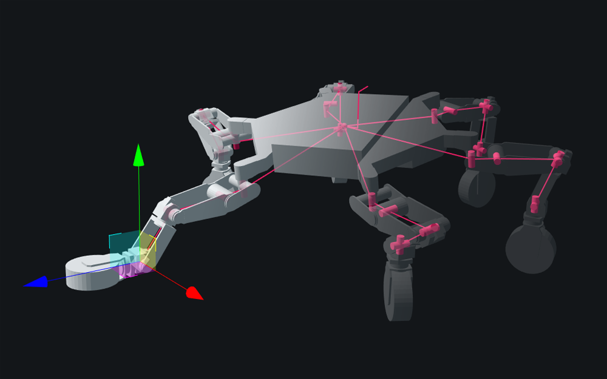

# Closed Chain Inverse Kinematics

[](https://github.com/gkjohnson/closed-chain-ik-js/actions)
[](https://github.com/gkjohnson/closed-chain-ik-js/)
[](https://twitter.com/garrettkjohnson)
[](https://github.com/sponsors/gkjohnson/)

A generalized inverse kinematics solver that supports closed chains for parallel kinematics systems, dynamic reconfiguration, and arbitrary joint configuration based on damped least squares error minimization techniques. Supports all variety of joints including combinations of rotation and translation degrees of freedom and is agnostic to visualization framework. Inspired by [Marty Vona's MSim research work](https://www2.ccs.neu.edu/research/gpc/MSim/MSim-info.html) and using techniques outlined in this [2009 paper by Samuel Buss](https://math.ucsd.edu/~sbuss/ResearchWeb/ikmethods/iksurvey.pdf). Developed with some aid and advice from [Marty Vona](https://www2.ccs.neu.edu/research/gpc/vona.html).



_<p align="center">Solver being used on JPL's ATHLETE robot for full body IK</p>_

## Examples

[Hexapod demo](https://gkjohnson.github.io/closed-chain-ik-js/dist/hexapod.html)

[ATHLETE and Robonaut demo](https://gkjohnson.github.io/closed-chain-ik-js/dist/index.html)

[Rover mobility settling demo](https://gkjohnson.github.io/closed-chain-ik-js/dist/settling.html)

[VR demo](https://gkjohnson.github.io/closed-chain-ik-js/dist/vr.html)

[Partial degrees of freedom Goal demo](https://gkjohnson.github.io/closed-chain-ik-js/dist/goals.html)

## Model License Information

Robitics models used in the project are for demonstration purposes only and subject to the licenses of their respective projects.

[ATHLETE](https://github.com/gkjohnson/urdf-loaders/)

[Robonaut](https://github.com/gkjohnson/nasa-urdf-robots)

[Curiosity](https://github.com/gkjohnson/curiosity_mars_rover-mirror)

[Perseverance](https://github.com/gkjohnson/m2020-urdf-models)

[Staubli](https://github.com/ros-industrial/staubli_experimental)

[PI Hexapod](https://github.com/PI-PhysikInstrumente/PI_ROS_Driver)

[Digit](https://github.com/adubredu/DigitRobot.jl)

[Spot](https://github.com/heuristicus/spot_ros)

# Installation

```
npm install github:@gkjohnson/closed-chain-ik-js
```

# Use

## Entry Points

| Entry point | Contents | Reference |
|---|---|---|
| `closed-chain-ik` | The core and three.js entry points together. Requires `three` and `urdf-loader`. | [core](./src/core/API.md) · [three](./src/three/API.md) |
| `closed-chain-ik/core` | The solver, frames, and `IKUtils`. Has no three.js dependency. | [API Reference](./src/core/API.md) |
| `closed-chain-ik/three` | `IKRootsHelper` and `URDFUtils` for use with three.js and urdf-loader. | [API Reference](./src/three/API.md) |
| `closed-chain-ik/worker` | `WorkerSolver`. Not included in the root entry point. | [API Reference](./src/worker/API.md) |

## Simple 2 DoF System

```js
import { Solver, Joint, Link, Goal, DOF } from 'closed-chain-ik';

// Create links and joints
const link1 = new Link();

const joint1 = new Joint();
joint.setDoF( DOF.EZ );
joint.setPosition( 0, 1, 0 );
joint.setDoFValues( Math.PI / 4 );

const link2 = new Link();

const joint2 = new Joint();
joint.setDoF( DOF.EX );
joint.setPosition( 0, 1, 0 );
joint.setDoFValues( Math.PI / 4 );

const link3 = new Link();
link3.setPosition( 0, 1, 0 );

// Create the goal
const goal = new Goal();
link3.getWorldPosition( goal.position );
link3.getWorldQuaternion( goal.quaternion );

// Create structure
link1.addChild( joint1 );
joint1.addChild( link2 );
link2.addChild( joint2 );
joint2.addChild( link3 );

goal.makeClosure( link3 );

// create solver
const solver = new Solver( link1 );

// ...

// move the goal around and solve
goal.setPosition( 1, 2, 3 );
solver.solve();
```

## Using a WebWorker Solver

```js
import { Joint, Link, Goal, DOF } from 'closed-chain-ik';
import { WorkerSolver } from 'closed-chain-ik/worker';

// ... instantiate kinematic system...

const solver = new WorkerSolver( link1 );

// ...

// move the goal around and solve asynchronously
solver.solve();
```

# Caveats

- The web worker implementation uses ShareArrayBuffers which are not available on some platforms (Safari, Chrome for Android). See issue [#44](https://github.com/gkjohnson/closed-chain-ik-js/issues/44).

- Enabling SVD on the Solver adds damping in near singular directions but is several times slower than the default solve.
